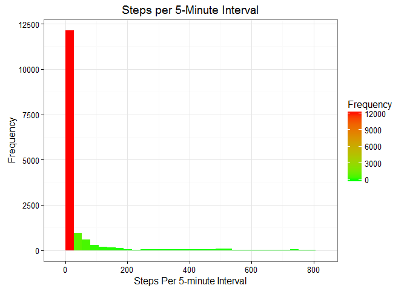
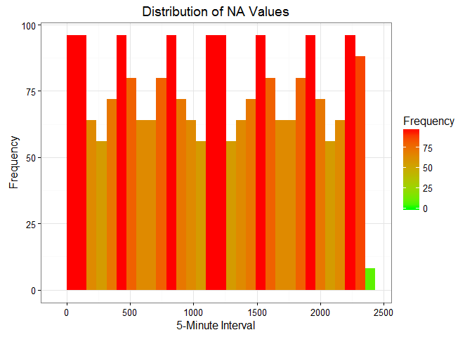
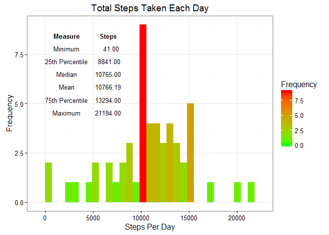
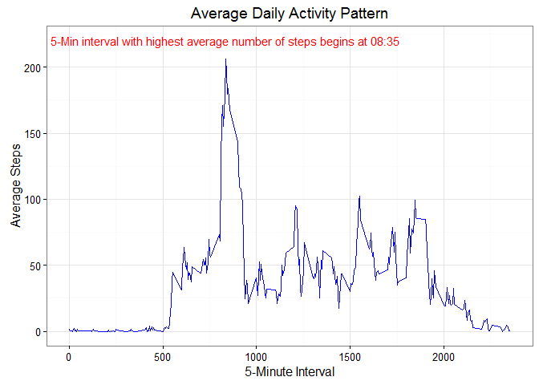
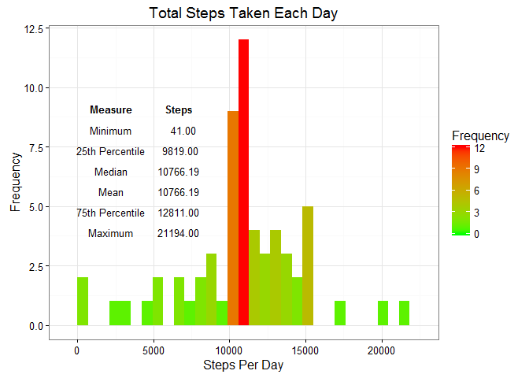
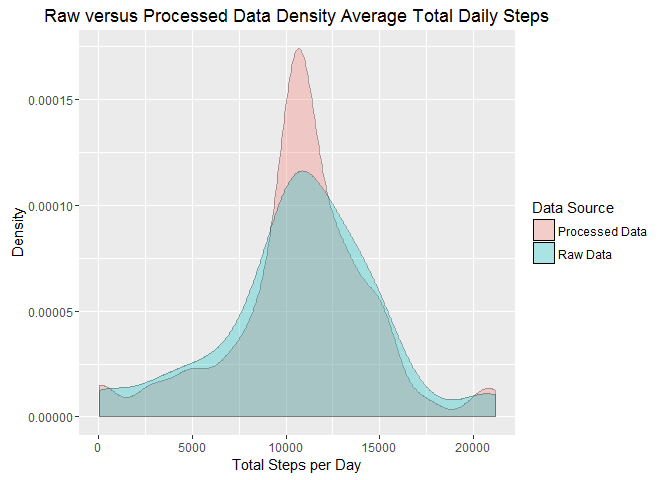
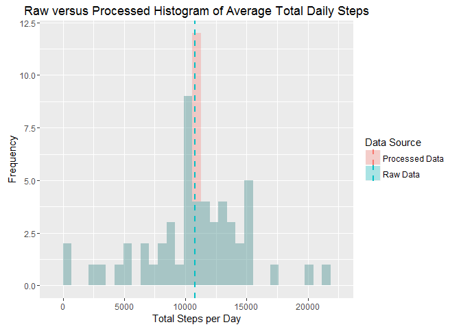
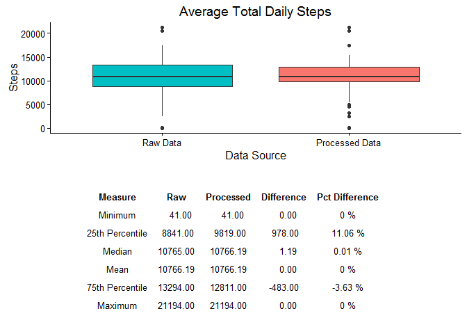
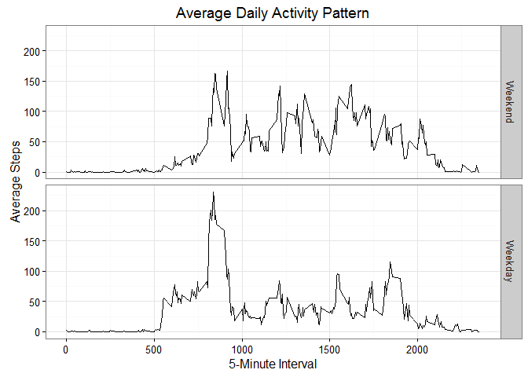

# Reproducible Research - Peer Assessment 1
John James  
March 6, 2016  


## Introduction

It is now possible to collect a large amount of data about personal movement using activity monitoring devices such as a Fitbit, Nike Fuelband, or Jawbone Up. These type of devices are part of the "quantified self" movement - a group of enthusiasts who take measurements about themselves regularly to improve their health, to find patterns in their behavior, or because they are tech geeks.  

## Research Question
This analysis seeks to address the following research question:

> What activity and behavior patterns can be ascertained from a retrospective observation of movement data obtained from these enthusiasts?

More specifically, 

1. What is mean total number of steps taken per day?
2. What is the average daily activity pattern?
3. How do these observations change with imputed data?
4. Are there differences in activity patterns between weekdays and weekends?

## Data
This project makes use of data from a personal activity monitoring device. This device collects data at # 5 minute intervals through out the day. The data consists of two months of data from an anonymous individual collected during the months of October and November, 2012 and include the number of steps taken in 5 minute intervals each day.

The data for this assignment was downloaded from the course web site: https://d396qusza40orc.cloudfront.net/repdata%2Fdata%2Factivity.zip

The variables included in this dataset are:

* steps: Number of steps taking in a 5-minute interval (missing values are coded as NA)
* date: The date on which the measurement was taken in YYYY-MM-DD format
* interval: Identifier for the 5-minute interval in which measurement was taken

The dataset is stored in a comma-separated-value (CSV) file and there are a total of 17,568 observations in this dataset.

## The Analysis
The has been organized as follows. 

1.  Load Data - Load the raw data into the environment 
2.  Mean Average Total - Calculates mean average totalsteps per day and produces a histogram
3.  Activity Pattern - Prepares a time series of activity, in terms of steps per 5 minute interval across all days
4.  Impute Values - Missing values are replaced by the average number of steps per day across all days for the missing time interval
5.  Comparison - Compared density, histogram and box plots for the raw and processed data are prepared 
6.  Weekend/Weekday - Time series line charts are prepared for both weekday and weekends.

### Load Data


The following code downloads the data from the course website and loads it into a data frame for processing.  To avoid overloading the server, functionality is included to ensure that the raw data is only downloaded once per day.

```r
loadZipData <- function(url, dir, zip, csv) {
    if (missing(url)) {
        stop("Missing url for data")
    }
    if (missing(dir)) {
        stop("Directory to which the data is to be stored, must be specified")
    }
    if (missing(zip)) {
        stop("The name of the zip file must be specified")
    }
    if (missing(csv)) {
        stop("The name of the csv file must be specified")
    }
    homeDir <- getwd()
    if (!dir.exists(file.path(homeDir, dir))) {
        dir.create(file.path(homeDir, dir), recursive = TRUE)
    }
    setwd(file.path(homeDir, dir))
    today <- Sys.Date()
    cDate <- as.Date(file.info(zip)$ctime)
    if ((!file.exists(zip)) | (cDate != today)) {
        download(url, dest = zip, mode = "wb")
        unzip(zip)
    }
    df <- read.csv(csv)
    setwd(homeDir)
    return(df)
}
```


```r
rawActivities <- loadZipData(dataUrl, rawDataDir, dataZipFile, dataCsvFile)
```

The following table indicates the total number of observations, the number of complete cases (missing values) and the percentage of the total data that is missing.

```r
calcLoadStats <- function(x) {
    if (missing(x)) {
        stop("Data frame to be summarized must be provided")
    }
    total <- nrow(rawActivities)
    complete <- nrow(na.omit(rawActivities))
    missing <- total - complete
    pctMissing <- round(missing/total * 100, 2)
    Measure <- c("Total", "Complete", "Missing", "Pct Missing")
    Values <- c(total, complete, missing, pctMissing)
    df <- data.frame(Measure, Values)
    return(df)
}
```


```r
loadStats <- calcLoadStats(rawActivities)
print(loadStats)
```

```
##       Measure   Values
## 1       Total 17568.00
## 2    Complete 15264.00
## 3     Missing  2304.00
## 4 Pct Missing    13.11
```

The summary statistics in general, and the mean and median values specifically, suggest the data is significantly right skewed.  

```r
print(summary(rawActivities$steps))
```

```
##    Min. 1st Qu.  Median    Mean 3rd Qu.    Max.    NA's 
##    0.00    0.00    0.00   37.38   12.00  806.00    2304
```

The histogram below confirms the skewed distribution of steps taken per 5-minute interval.

```r
makeLoadHist <- function(x) {
    if (missing(x)) {
        stop("Data argument must be provided")
    }
    h <- ggplot(x, aes(x = steps)) + geom_histogram(aes(fill = ..count..), na.rm = TRUE) + 
        scale_fill_gradient("Frequency", low = "green", high = "red") + xlab("Steps Per 5-minute Interval") + 
        ylab("Frequency") + labs(title = "Steps per 5-Minute Interval") + theme_bw(base_family = "sans")
    suppressMessages(print(h))
    return(h)
}
```


```r
loadHist <- makeLoadHist(rawActivities)
```



Next, we examine the NA values.  The following histogram illuminates the frequency distribution of missing values for each 5-minute interval.  

```r
loadMissingData <- rawActivities[is.na(rawActivities$steps), ]
```


```r
missingDataHist <- function(x) {
    if (missing(x)) {
        stop("Data frame to be summarized must be provided")
    }
    h <- ggplot(x, aes(x = interval)) + geom_histogram(aes(fill = ..count..), 
        na.rm = TRUE) + scale_fill_gradient("Frequency", low = "green", high = "red") + 
        xlab("5-Minute Interval") + ylab("Frequency") + labs(title = "Distribution of NA Values") + 
        theme_bw(base_family = "sans")
    suppressMessages(print(h))
    return(h)
}
```


```r
loadMissingDataHist <- missingDataHist(loadMissingData)
```



The plot suggests that the missing values are evenly spread over the day.

### Mean Average Total
The following functionality explores the average total number of steps taken per day. It produces a histogram with summary statistics showing the frequency distribution of average total steps per day.

First, we obtain only the complete cases from the raw data set.

```r
completeCases <- rawActivities[complete.cases(rawActivities), ]
```

Next, the summate function summarizes the raw data by the average of total steps taken per day.   

```r
summate <- function(x, v = "date", f = "sum") {
    if (missing(x)) {
        stop("Data frame to be summarized must be provided")
    }
    if (!any(v == c("date", "interval"))) {
        stop("Invalid variable name")
    }
    if (!any(f == c("sum", "mean"))) {
        stop("Invalid function name")
    }
    if (v == "date" & f == "sum") {
        df <- x %>% group_by(date) %>% summarize(steps = sum(steps))
    }
    else if (v == "interval" & f == "sum") {
        df <- x %>% group_by(interval) %>% summarize(steps = sum(steps))
    }
    else if (v == "date" & f == "mean") {
        df <- x %>% group_by(date) %>% summarize(steps = mean(steps))
    }
    else {
        df <- x %>% group_by(interval) %>% summarize(steps = mean(steps))
    }
    return(df)
}
```


```r
stepsByDay01 <- summate(x = completeCases, v = "date", f = "sum")
```

Compute the summary statistics for average total steps per day and place that into a table that will be processed and rendered onto the histogram.

```r
computeStats <- function(x) {
    if (missing(x)) {
        stop("Data frame to be summarized must be provided")
    }
    min <- min(x$steps)
    q1 <- unname(quantile(x$steps, probs = 0.25))
    med <- median(x$steps)
    mn <- mean(x$steps)
    q3 <- unname(quantile(x$steps, probs = 0.75))
    mx <- max(x$steps)
    No <- c(1, 2, 3, 4, 5, 6)
    Measure <- c("Minimum", "25th Percentile", "Median", "Mean", "75th Percentile", 
        "Maximum")
    Steps <- c(min, q1, med, mn, q3, mx)
    stbl <- data.frame(No, Measure, Steps)
    return(stbl)
}
```


```r
stats01 <- computeStats(stepsByDay01)
```
Prepare and render the histogram with summary statistics.


```r
makeHist <- function(x, s) {
    if (missing(x)) {
        stop("Data argument must be provided")
    }
    s <- select(s, Measure, Steps)
    tt <- ttheme_minimal(base_size = 10)
    g <- tableGrob(s, theme = tt, rows = NULL)
    h <- ggplot(x, aes(x = steps)) + geom_histogram(aes(fill = ..count..), na.rm = TRUE) + 
        scale_fill_gradient("Frequency", low = "green", high = "red") + xlab("Steps Per Day") + 
        ylab("Frequency") + labs(title = "Total Steps Taken Each Day") + theme_bw(base_family = "sans") + 
        annotation_custom(g, xmin = 0, xmax = 8000, ymin = 5, ymax = 8)
    suppressMessages(print(h))
    return(h)
}
```


```r
stepsHist01 <- makeHist(stepsByDay01, stats01)
```



The total average number of steps per day has a range of approximately 20,000 steps, with most of the values concentrated between 10,000 and 15,000 steps per day.  The remarkably high density of observations at the median/mean suggests a homogeneity within the sample group, at least as it pertains to the amount of daily activity. 

### Daily Activity Pattern
This section of the analysis seeks to illuminate patterns in the daily activity of the subjects.  A time series plot of the 5-minute interval and the average number of steps taken, averaged across all days (y-axis) is presented showing the 5-minute interval, on average across all the days in the dataset, that contains the maximum number of steps?

Using the summate function above, we summarize the observations by average number of steps per 5-minute interval.  


```r
stepsByInterval01 <- summate(completeCases, "interval", "mean")
```

Next we call the makeTimeSeriesFunc to produce the line graph.


```r
makeTimeSeries <- function(x) {
    if (missing(x)) {
        stop("Data argument must be provided")
    }
    maxInterval <- calcInterval(x)
    l <- ggplot(x, aes(x = interval, y = steps)) + geom_line(colour = "blue") + 
        xlab("5-Minute Interval") + ylab("Average Steps") + labs(title = "Average Daily Activity Pattern") + 
        theme_bw(base_family = "sans") + annotate("text", x = 835, y = 220, 
        label = paste("5-Min interval with highest average number of steps begins at", 
            maxInterval), colour = "red")
    suppressMessages(print(l))
    return(l)
}
```


```r
stepTimeSeries01 <- makeTimeSeries(stepsByInterval01)
```



It would appear that the most active 5 minutes of the day are between 8:35 and 8:40 am.

### Impute Values
Note that there are a number of days/intervals where there are missing values (coded as NA). The presence of missing days may introduce bias into some calculations or summaries of the data.  This section imputes the missing data and summarizes key statistics.

First we ascertain the number of NA values in the raw dataset.

```r
missingValues <- sum(is.na(rawActivities$steps))
print(paste("There are", missingValues, "rows with NAs in the steps variable"))
```

```
## [1] "There are 2304 rows with NAs in the steps variable"
```

Next, we impute the data.  The strategy was to replace the missing value for each 5 minute interval with the average for that 5 minute interval calculated over all the days of the study.  Refer to the comments in the code for detailed explanation of the process.

```r
impute <- function(x, stepsByInterval, f) {
    # This function imputes missing step count data by substituting the mean for
    # the associated 5-minute time interval across all days.  Args: x - the
    # original activities data frame stepsByInterval - a dataframe containing
    # the average number of steps per 5-minute interval f - the name of the file
    # in which the imputed data frame will be saved Returns: new activities data
    # frame with missing values imputed
    
    # Validate arguments
    if (missing(x)) {
        stop("Activities file must be provided")
    }
    if (missing(stepsByInterval)) {
        stop("stepsByInterval dataframe must be provided")
    }
    if (missing(f)) {
        stop("The filename for the imputed data frame must be provided")
    }
    
    # Make a copy of the activities data frame passed as an argument
    newdf = data.frame(x)
    
    # The approach here is to merge the newActivities and stepsByInterval data
    # frames. This will add a column to each row in newActivities with the
    # average steps for the time interval.
    newdf <- merge(newdf, stepsByInterval, by = "interval")
    
    # Next, we use the ifelse construct to identify missing values and to
    # replace them with the average value in the column just added.
    newdf <- transform(newdf, steps.x = ifelse(is.na(steps.x), steps.y, steps.x))
    
    # Remove the extra averages column and reset the column names.
    newdf$steps.y <- NULL
    names(newdf) <- c("interval", "steps", "date")
    
    # Set the directory where this processed data set is to be saved.
    dataDir <- "/Data/Processed Data"
    
    # Create data directory if does not already exist and set working directory
    if (!dir.exists(file.path(homeDir, dataDir))) {
        dir.create(file.path(homeDir, dataDir), recursive = TRUE)
    }
    setwd(file.path(homeDir, dataDir))
    
    # Save data set
    write.csv(newdf, file = f)
    
    # Reset working directory
    setwd(homeDir)
    
    return(newdf)
    
}
```


```r
procActivities <- impute(rawActivities, stepsByInterval01, "procActivities.csv")
```

Next the processed data is summarized by average total steps taken each day.  The summate function referenced above,  is used for this calculation.


```r
stepsByDay02 <- summate(x = procActivities, v = "date", f = "sum")
```

Next, summary statistics are calculated to show the mean and median average total steps per day.

```r
computeStats <- function(x) {
    if (missing(x)) {
        stop("Data frame to be summarized must be provided")
    }
    min <- min(x$steps)
    q1 <- unname(quantile(x$steps, probs = 0.25))
    med <- median(x$steps)
    mn <- mean(x$steps)
    q3 <- unname(quantile(x$steps, probs = 0.75))
    mx <- max(x$steps)
    No <- c(1, 2, 3, 4, 5, 6)
    Measure <- c("Minimum", "25th Percentile", "Median", "Mean", "75th Percentile", 
        "Maximum")
    Steps <- c(min, q1, med, mn, q3, mx)
    stbl <- data.frame(No, Measure, Steps)
    return(stbl)
}
```


```r
stats02 <- computeStats(stepsByDay02)
```

Finally, the histogram and summary statistics are prepared and rendered using the makeHist function from above.


```r
stepsHist02 <- makeHist(stepsByDay02, stats02)
```



### Comparison
At this stage, we seek to illustrate the ways in which these values differ from the estimates from the first part of the assignment and the impact of imputing missing data on the estimates of the total daily number of steps.

First we conjoin the raw and processed data into a single data frame.

```r
conjoin <- function(x, y) {
    x$source <- "Raw Data"
    x$source_order <- 1
    y$source <- "Processed Data"
    y$source_order <- 2
    z = rbind(x, y)
    z <- z[complete.cases(z), ]
    return(z)
}
```


```r
combined <- conjoin(stepsByDay01, stepsByDay02)
```

Next, we included a density plot to show the relative frequencies of average total steps per day between the raw and processed data.


```r
makeDensityPlot <- function(x) {
    if (missing(x)) {
        stop("Data argument must be provided")
    }
    d <- ggplot(x, aes(x = steps, fill = source)) + geom_density(alpha = 0.3) + 
        ylab("Density") + xlab("Total Steps per Day") + scale_fill_discrete(name = "Data Source") + 
        labs(title = "Raw versus Processed Data Density Average Total Daily Steps")
    suppressMessages(print(d))
    return(d)
}
```


```r
density <- makeDensityPlot(combined)
```



We observe that their is a higher density of average total steps per day near the median. This is expected, given the strategy we used to impute the data.

The histogram confirms a significantly higher concentration of values at the mean.

```r
makeOverlaidHist <- function(x) {
    if (missing(x)) {
        stop("Data argument must be provided")
    }
    meansData <- ddply(x, "source", summarise, stepsMean = mean(steps))
    d <- ggplot(x, aes(x = steps, fill = source), environment = environment()) + 
        geom_histogram(alpha = 0.3, position = "identity") + geom_vline(data = meansData, 
        aes(xintercept = stepsMean, colour = source), linetype = "dashed", size = 1) + 
        ylab("Frequency") + xlab("Total Steps per Day") + scale_fill_discrete(name = "Data Source") + 
        scale_colour_discrete(name = "Data Source") + labs(title = "Raw versus Processed Histogram of Average Total Daily Steps")
    suppressMessages(print(d))
    return(d)
}
```


```r
stepsHist03 <- makeOverlaidHist(combined)
```



Next we compute the difference in summary statistics for each data set into a data frame that can then be rendered onto a boxplot.

```r
compareStats <- function(x, y) {
    if (missing(x)) {
        stop("Summary statistic data table x must be provided")
    }
    if (missing(y)) {
        stop("Summary statistic data table y must be provided")
    }
    z <- merge(x, y, by = "Measure")
    z <- mutate(z, Difference = round((z$Steps.y - z$Steps.x), 2), Pct_Difference = paste(round(((z$Steps.y - 
        z$Steps.x)/z$Steps.x) * 100, 2), "%"))
    arrange(z, No.x)
    z <- select(z, No.x, Measure, Steps.x, Steps.y, Difference, Pct_Difference)
    names(z) <- c("No", "Measure", "Raw", "Processed", "Difference", "Pct Difference")
    return(z)
}
```


```r
difference <- compareStats(stats01, stats02)
```

Finally, the boxplot illuminates the differences in the summary statistics.

```r
makeBoxPlot <- function(x, s) {
    if (missing(x)) {
        stop("Data argument must be provided")
    }
    if (missing(s)) {
        stop("Summary statistics must be provided")
    }
    x$source_id <- reorder(x$source, x$source_order)
    b <- ggplot(x, aes(x = source_id, y = steps, fill = source)) + geom_boxplot() + 
        guides(fill = FALSE) + ylab("Steps") + xlab("Data Source") + scale_fill_discrete(name = "Data Source") + 
        labs(title = "Average Total Daily Steps") + theme_classic()
    s <- arrange(s, No)
    s <- s %>% select(everything(), -contains("No"))
    tt <- ttheme_minimal(base_size = 10)
    t <- tableGrob(s, theme = tt, rows = NULL)
    x <- grid.arrange(b, t, nrow = 2)
    print(x)
    return(x)
}
```


```r
stepsBox <- makeBoxPlot(combined, difference)
```



```
## TableGrob (2 x 1) "arrange": 2 grobs
##   z     cells    name               grob
## 1 1 (1-1,1-1) arrange     gtable[layout]
## 2 2 (2-2,1-1) arrange gtable[colhead-fg]
```

There was an 11% increase in average total steps per day in the 25th percentile, suggesting that the majority of missing values were for periods of relatively low activity.  The proximity of the median and means, both within and across the data sets, suggests two things.  First, the distribution of average total steps per day tended to appoximate a normal distribution, and second, imputing the data using our scheme had little affect on the estimates.

### Weekend/Weekday Activity Analysis
Our final step in this analysis is to observe whether there was any significant difference in activity during the weekdays vis-a-vis weekends.  For this analysis, we show comparative 5-minute interval time series for both weekends and weekdays.

First, we add a categorical factor value to the data set that indicates whether an observation was on a weekday or a weekend.

```r
dayLabel <- function(x) {
    if (missing(x)) {
        stop("Data argument must be provided")
    }
    x$date <- as.Date(x$date, format = "%Y-%m-%d")
    weekend <- c("Saturday", "Sunday")
    x$dayLabel <- factor((weekdays(x$date) %in% weekend), levels = c(TRUE, FALSE), 
        labels = c("Weekend", "Weekday"))
    return(x)
}
```


```r
procActivities <- dayLabel(procActivities)
```

Next we summarize average total steps per day, by the weekday/weekend categorical factor.

```r
summateWd <- function(x) {
    if (missing(x)) {
        stop("Data frame to be summarized must be provided")
    }
    df <- x %>% group_by(dayLabel, interval) %>% summarize(steps = mean(steps))
    return(df)
}
```


```r
stepsByIntervalWd <- summateWd(procActivities)
```

Lastly, we produce the time series.

```r
makeTimeSeriesWd <- function(x) {
    if (missing(x)) {
        stop("Data argument must be provided")
    }
    l <- ggplot(x, aes(x = interval, y = steps, group = dayLabel, colour = dayLabel)) + 
        geom_line() + xlab("5-Minute Interval") + ylab("Average Steps") + labs(title = "Average Daily Activity Pattern") + 
        theme_bw(base_family = "sans") + scale_colour_discrete(name = "")
    suppressMessages(print(l))
    return(l)
}
```


```r
stepTimeSeriesWd <- makeTimeSeriesWd(stepsByIntervalWd)
```



As one might expect, the data shows less activity during the morning hours on the weekends, but significantly greater activity starting during the early afternoon and into the early evening, then peaking once again around 2100 hours.
